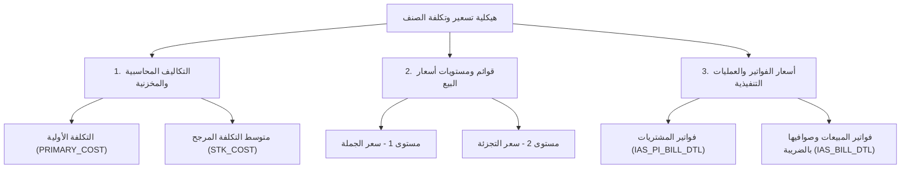

# دليل ودليل هيكلية الأسعار والتكاليف في نظام أونكس (Onyx ERP Pricing & Costing Guide)

هذا المستند يُفصل المفهوم الشامل والدقيق لهيكلية وتخزين أسعار وتكاليف الأصناف داخل قاعدة بيانات نظام أونكس **Onyx ERP**، وكيفية التمييز بين الأسعار المرجعية، التكاليف المحاسبية، وأسعار الفواتير التنفيذية للعملاء والموردين.

---

## 📌 1. المفهوم العام للتسعير والتكاليف في أونكس

في نظام أونكس ERP، لا يُوجد "سعر واحد ثابت" للصنف، بل تنقسم الأسعار والتكاليف إلى **3 محاور رئيسية**:



1. **المحور الأول: التكاليف المحاسبية والمخزنية (Inventory & Costing):**
   * يعبر عن التكلفة الحقيقية التي تكبدتها الشركة لاقتناء البضاعة (سعر الشراء من المورد + مصاريف الشحن والتأمين والجمارك + التقييم المرجح للمخزون WAC).
2. **المحور الثاني: قوائم ومستويات أسعار البيع (Sales Price Lists):**
   * يعبر عن السياسة البيعية المعتمدة من الإدارة (سعر الجملة، سعر التجزئة، الحدود الأدنى والأعلى للسعر).
3. **المحور الثالث: أسعار العمليات والفواتير التنفيذية (Transaction Invoice Prices):**
   * يعبر عن السعر الفعلي الذي تم به البيع أو الشراء بالسطر في الفاتورة (متضمناً الخصومات المباشرة والخصومات الإضافية والضريبة المضافة 15%).

---

## 🗄️ 2. الجداول المرجعية وتخزين الأسعار في قاعدة البيانات

تنقسم بيانات الأسعار والتكاليف عبر الجداول التالية في مخطط أونكس (`IAS20261`):

### أ) جدول الصنف الرئيسي (`IAS20261.IAS_ITM_MST`)
يحتوي على المؤشرات السعرية والتكليفية المبدئية للصنف:
* **`PRIMARY_COST`**: التكلفة الأولية المعيارية للوحدة.
* **`INIT_PRIMARY_COST`**: التكلفة الافتتاحية المبدئية المسجلة عند إدخال كرت الصنف لأول مرة.
* **`VNDR_PRICE`**: السعر المرجعي المعتمد للشراء من المورد.

### ب) جدول قوائم الأسعار ومستويات البيع (`IAS20261.IAS_ITEM_PRICE`)
يحتوي على شرائح أسعار البيع المعتمدة لكل وحدة ومستوى:
* **`LEV_NO = 1`**: سعر بيع الجملة المعتمد.
* **`LEV_NO = 2`**: سعر بيع التجزئة المعتمد للمستهلك.
* **`ITM_UNT`**: وحدة القياس (حبة، كرتون... إلخ).
* **`AD_DATE` / `UP_DATE`**: تاريخ إضافة وتعديل السعر والمستخدم الذي قام بالتعديل.

### ج) جدول سجل تاريخ تغيير الأسعار (`IAS20261.IAS_ITEM_PRICE_HISTORY`)
يحتوي على الأرشيف والتتبع الزمني لأي عملية تعديل أو تغيير على أسعار الصنف:
* **`PREV_I_PRICE`**: السعر السابق قبل التعديل.
* **`I_PRICE`**: السعر الجديد بعد التعديل.
* **`AUD_DATE` / `AUD_U_ID`**: توقيت التعديل والرقم التعريفي للمستخدم المسؤول عن التغيير.

### د) جدول فواتير المشتريات من الموردين (`IAS20261.IAS_PI_BILL_DTL`)
يحتوي على أسعار شراء الشحنات الواردة من الموردين:
* **`I_PRICE`**: سعر شراء الوحدة الخام من المورد.
* **`DISC_AMT`**: خصومات المورد المباشرة على الفاتورة.

### هـ) جدول فواتير المبيعات الفعلية للعملاء (`IAS20261.IAS_BILL_DTL`)
يحتوي على تفاصيل القيمة البيعية الفعلية والصافية لكل فاتورة:
* **`I_PRICE`**: سعر البيع المعلن للوحدة بالسطر.
* **`DIS_AMT`**: خصم السطر المباشر الممنوح للعميل.
* **`STK_COST`**: التكلفة المخزنية المعتمدة وقت البيع لحساب مجمل ربح الفاتورة.
* **`Net Unit Price`**: صافي سعر الوحدة قبل الضريبة = `(I_QTY * I_PRICE - DIS_AMT) / I_QTY`.
* **`Unit Price with VAT`**: صافي سعر الوحدة شامل الضريبة 15% = `Net Unit Price * 1.15`.

### و) جدول حركة وتكلفة المخزون المرجحة (`IAS20261.ITEM_MOVEMENT`)
يحتوي على تقييم وتكلفة حركة المخزون المستمرة (Weighted Average Cost):
* **`STK_COST` / `I_COST`**: متوسط التكلفة المرجحة للوحدة في المخازن وقت الحركة.

---

## 🔄 3. الفرق بين المفاهيم السعرية الخمسة

1. **سعر الشراء المباشر (Vendor Price):** السعر المتفق عليه مع المورد في فواتير الشراء.
2. **التكلفة المخزنية (Stock Cost WAC):** سعر الشراء + مصاريف الشحن والجمارك والتخزين الموزعة على الوحدة.
3. **سعر قائمة الأسعار (Price List Price):** السعر المستهدف والمعلن برمجياً في شاشات المبيعات.
4. **الصافي الفعلي بدون ضريبة (Net Invoice Price):** السعر الفعلي الذي دفعه العميل بعد تطبيق الخصومات وقبل احتساب الضريبة.
5. **السعر النهائي بالضريبة (Final Consumer Price with VAT):** المبلغ الكلي النهائي شاملاً ضريبة القيمة المضافة 15%.

---

## 🎯 4. مثال تطبيقي شامل من قاعدة البيانات Real-World Example

فيما يلي التطبيق العملي الفعلي لرحلة تسعير وتكلفة الصنف **`HIKT-100S4KWQ3` (شاشة هايكس 100 بوصة سمارت فوركية كيولد)** من واقع استعلامات قاعدة بيانات النظام:

```
ملخص التتابع السعري للصنف HIKT-100S4KWQ3:
سعر الشراء من المورد: 2,894.04 ريال
التكلفة المخزنية بعد المصاريف: 3,319.23 ريال
سعر قائمة أسعار الجملة: 3,700.00 ريال
سعر قائمة أسعار التجزئة: 4,199.00 ريال
سعر البيع النهائي للمستهلك بالضريبة: 4,830.00 ريال
```
